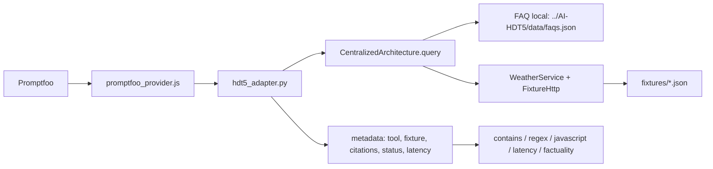

# HDT-6 — evaluación reproducible de HDT-5

Este repositorio evalúa la interfaz real de `../AI-HDT5` con Promptfoo. El
provider local ejecuta `hdt5_adapter.py`, que importa la arquitectura
centralizada de HDT-5, carga `data/faqs.json` y sustituye el transporte de
Open-Meteo por fixtures JSON. Por ello los casos son deterministas y no
requieren red.

## Flujo



## Ejecución

```bash
python3 -m venv .venv
.venv/bin/python -m pip install -r requirements-dev.txt

# suite completa (sin red)
.venv/bin/python -m pytest -q

# evaluación Promptfoo (descarga npx si el entorno permite red)
npx promptfoo@latest eval --no-cache -c promptfooconfig.yaml

# control local reproducible si no hay Promptfoo/grader disponible
../AI-HDT5/.venv/bin/python local_eval.py
```

La variable `PYTHON` permite elegir el intérprete usado por el provider, por
ejemplo `PYTHON=.venv/bin/python`. El provider devuelve metadata para verificar
la selección/ejecución de `faq` o `weather`, además de citas y latencia.

Las fechas son reproducibles porque el adaptador usa `2026-09-26` como fecha
de evaluación; puede sobrescribirse con `HDT5_EVAL_TODAY=YYYY-MM-DD`.

En este entorno, `npx promptfoo@latest eval --no-cache` no produjo una
evaluación ni un reporte nativo de Promptfoo: el DNS devolvió `EAI_AGAIN
getaddrinfo registry.npmjs.org` y npm indicó `ENOTCACHED` al comprobar que
Promptfoo no estaba disponible en caché. La configuración sí incluye
assertions `factuality`; para ejecutarlas Promptfoo necesita un proveedor de
grading configurado (por ejemplo `--grader openai:gpt-5-mini` y sus
credenciales). Sin ese proveedor no se puede producir honestamente una métrica
factuality local.

## Cobertura

Se incluyen FAQ conocido y desconocido, clima favorable, marginal, cada una de
las cuatro reglas de rechazo meteorológico y fecha posterior a 16 días.
`contains`, `regex`, `latency` y una assertion JavaScript de metadata son
deterministas. La configuración declara además `factuality` para las
respuestas FAQ y meteorológicas; esa métrica es model-graded y requiere un
grader disponible durante la evaluación. Las respuestas exactas basadas en
fixtures funcionan como control determinista complementario. `local_eval.py`
genera `reports/local-eval.json` y `reports/local-eval.md`; ambos identifican
explícitamente el grader como `local-reference-control` y no como factualidad
model-graded de Promptfoo. La ejecución actual validó 9/9 casos y 45/45
checks.

## Limitaciones observadas

- La red/DNS del entorno no permitió instalar `pytest` dentro de `.venv` ni
  descargar Promptfoo con `npx`; los comandos y sus salidas exactas se
  registran en `reports/promptfoo-eval.md`.
- La verificación local de pytest usa temporalmente la instalación de pytest ya
  existente en el `.venv` de HDT-5 mediante `PYTHONPATH`; no altera HDT-5.
